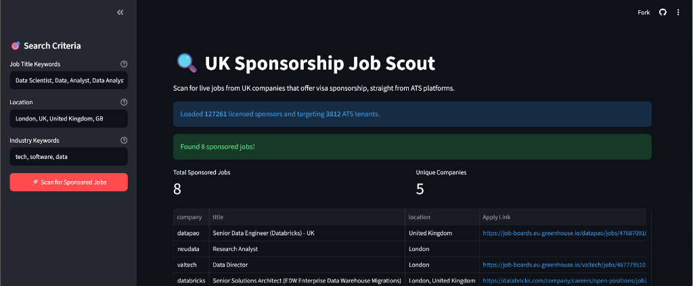

<h1 align="center">
  Sponsorship Scout
</h1>

  <strong>An automated, multi-tenant scraper for finding UK Visa Sponsored jobs across ATS platforms.</strong>

## What is it?
Sponsorship Scout is a robust Python package that dynamically scrapes popular ATS (Applicant Tracking System) platforms (Greenhouse, Lever, Ashby, SmartRecruiters, ...more to be added...) and cross-references the hiring companies against the **official UK Government Register of Licensed Sponsors**. 

It guarantees that every job it finds is from a company officially licensed to offer UK Visa Sponsorship.

## Features
- **Multi-Tenant:** Configure unlimited profiles for yourself and friends in a single YAML file.
- **Async Engine:** Blazing fast concurrent scraping of over 60,000+ endpoints.
- **Gov.uk Validation:** Automatically downloads the latest official UK Sponsor Register to filter companies.
- **Pluggable Destinations:** Send newly found jobs to **Discord**, a **GitHub Gist**, or a **local SQLite database**.
- **Streamlit Dashboards:** Includes a beautiful local dashboard to view your database, and a public-facing ad-hoc search app.
- **Built-in Scheduler:** Run it once, or leave it running continuously in the background.

---

## Installation

**1. Clone the repository:**
bash
git clone https://github.com/godspowerwodi/uk-sponsorship-scraper.git
cd uk-sponsorship-scraper

**2. Install the package:**
bash
# This installs the package and its dependencies globally
pip install ./sponsorship-scout

---

## Quick Start (Local CLI & Config)

The scraper uses a declarative \config.yaml\ to define profiles and destinations.

### 1. Create a \config.yaml\
Create a file named \config.yaml\ in your working directory:

yaml
profiles:
  - name: "Software Engineer"
    target_terms: ["software", "backend", "python"]
    target_locations: ["london", "uk"]
    industry_keywords: ["tech", "software"]
    destinations:
      - type: sqlite
        table_name: "software_jobs"
      - type: discord
        webhook_url: "https://discord.com/api/webhooks/..."

### 2. Run the CLI
The \sponsorship-scout\ command is now available in your terminal:

bash
# Run a one-off scrape
sponsorship-scout run --config config.yaml

# Run continuously every 24 hours
sponsorship-scout start-schedule --config config.yaml --hours 24

### 3. View the Dashboard
Once the scraper has populated your SQLite database, you can view the jobs in the beautiful local web dashboard:

sponsorship-scout ui --config config.yaml

---

## Public Cloud App
If you want to host an ad-hoc version of this app for the public (without local databases or config files), we provide a standalone \public_app.py\ script.

**To deploy to Streamlit Community Cloud:**
1. Go to [share.streamlit.io](https://share.streamlit.io)
2. Connect this repository.
3. Set the Main file path to: \sponsorship-scout/src/sponsorship_scout/ui/public_app.py\
4. Deploy! Users can now search for sponsored jobs dynamically from their phones or desktops.
**We also have a directly hosted version already for those who just want to dive right in**
(https://uk-sponsorship-scraper.streamlit.app/)
